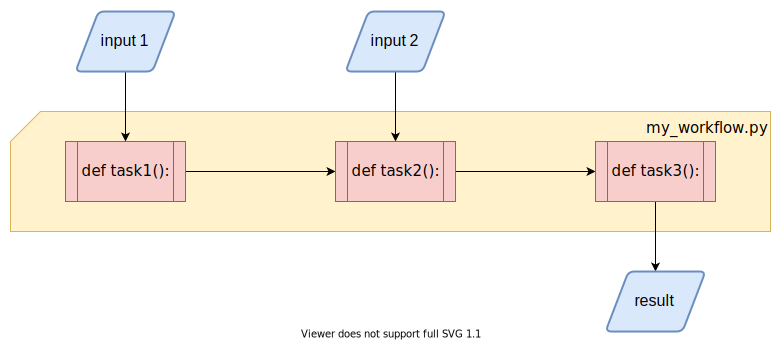
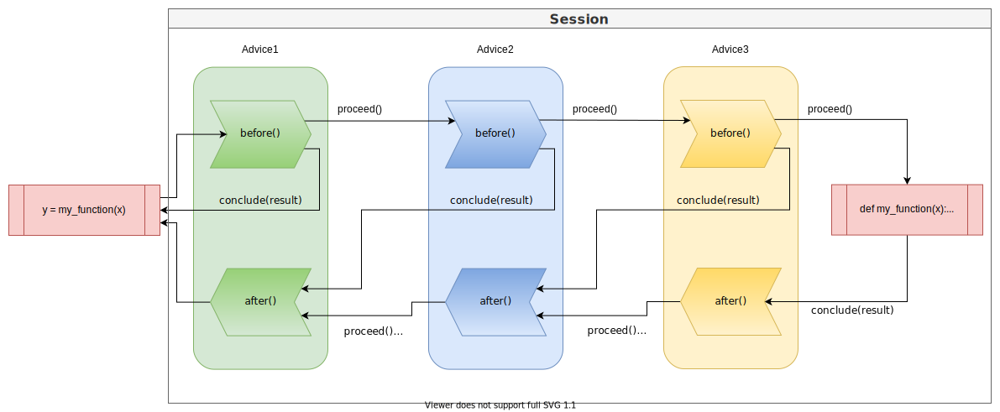

# User guide

This user guide can be used as a starting point for getting a deeper understanding of
the inner workings of the bandsaw library. It is meant for users who want to learn
about individual details or who plan to extend its features by developing own
advices or extensions.

## Concepts

First we start with some high-level concepts that we use throughout the library.
The purpose of this sections is to explain the structure of bandsaw and introduce a
common set of terms that helps to talk about the underlying ideas 

### Workflow

The fundamental basis in bandsaw is the idea of a workflow. We think of a workflow as
a single python script, that contains code for all individual steps that are performed
in a defined sequence. 



The individual steps can have dependencies on external inputs and on results of other
steps, so that they form a directed acyclic graph. Those steps are referred to as
`Tasks` within bandsaw.

Every single run of a workflow is assigned a unique identifier, called a "run id".

### Tasks

Tasks are pieces of code, that are used to process data. Task instances can be created
by calling the [`create_task(cls, obj)`](../api/#bandsaw.tasks.Task.create_task) class
function in the [`Task`](../api/#bandsaw.tasks.Task) class. At the moment, bandsaw
supports only free functions defined on module level as tasks.

Usually, tasks are defined by adding the [`@bandsaw.task`](../api/#bandsaw.decorator.task)
decorator to the code that should be executed as a task.

```python
@bandsaw.task
def my_function(x):
    return x
```

Each task has a unique `task_id` that is derived from the code that is executed. This can
be used to differentiate between different tasks.

Task can be given additional advice parameters, that influence how they are executed.
These advice parameters can be given as keyword arguments to the decorator:

```python
@bandsaw.task(my='argument')
def my_function(x):
    return x
```

### Executions

Tasks can take arbitrary arguments, which means we can have multiple executions of the
same task, that differ in the given arguments. This is captured by a
[`Execution`](../api/#bandsaw.execution.Execution) object, which encapsulates the arguments for a specific
task execution. Similar to the `task_id`, each execution has a separate `execution_id` that
differentiates between different executions based on their arguments.

### Advice

Objects that implement the [`Advice`](../api/#bandsaw.advice.Advice) protocol are the
mechanism that allows bandsaw to influence the execution of the task. Each advice class
can implement two different methods,
[`before(self, session)`](../api/#bandsaw.advice.Advice.before) and
[`after(self, session)`](../api/#bandsaw.advice.Advice.after). 

The `before()` method is called before the task is actually executed and allows the
advice to make changes to the way the task is executed, e.g. running the task on a
different system or returning a result early without executing the task at all.

The `after()` method is called after the task was actually executed and returned a
result. This allows an advice to make changes to the result or use it in a different way
than just returning it.

Both methods decide on what happens after by calling the appropriate method on the
current `session`, the sole argument both methods are taking.

### Session

A [`Session`](../api/#bandsaw.session.Session) is the object, that manages the process
of executing a task for a specific execution. It defines the different actions that advices
can take when their `before()` or `after()` methods are called.



When a task is being called within a workflow, a new `Session` object is instantiated
with the task, an execution object containing the tasks arguments and a list of advices, called
the "advice chain", that should be used for advising the execution.

Each session has a unique `session_id` that is derived from its task, the execution of
the task and the current `run_id`. This makes sure, that the same task with the same
arguments yields different session ids across multiple runs.

#### before() executing a task.
The session calls the `before()` methods of all advices one after another in the order
that the advices are defined in the advice chain. Each `Advice` has to tell the session
to either 

- continue with the next advice by calling
    [`session.proceed()`](../api/#bandsaw.session.Session.proceed)

or

- return early by skipping the following advices AND the actual task execution by
    calling [`session.conclude(result)`](../api/#bandsaw.session.Session.conclude) and
    providing a `Result` that should be used instead. After the advice has concluded
    with a result, the only advices whose `after()` methods will be called are the
    advices, that come before in the advice chain.

#### Executing the task
If all advices of the advice chain decided to `proceed()`, the session will execute
that task and keep the value it returns. If an exception or error is raised during
the execution it will be stored in the [`Result`](../api/#bandsaw.result.Result)
instance in the session.

#### after() executing a task
After the task has been executed, the session begins to call the `after()` methods of
the advices in the REVERSED order from the advice chain. This means the advice that was
called last for `before()` is called first for `after()`.
Now each advice can decide how to continue. Similar to `before()` there are two
possibilities:

- continue with the current result and the next advice by calling
    [`session.proceed()`](../api/#bandsaw.session.Session.proceed)

or

- return a different result and continue with that by calling 
    [`session.conclude(result)`](../api/#bandsaw.session.Session.conclude) with a
    different `Result` instance. All following advices will be called using `after()`
    with a session containing the new result.

Once all advices have finished, the session will unpack the result and either return
its value to the workflow or re-raise the error.

#### Serializing the session

In order to move the execution of a task across different python interpreters, an advice
can use the capability of a `Session` to serialize its state to a stream and recreate it
at a later point in time or on a different platform.

For this the session contains two methods, [`save(stream)`](../api/#bandsaw.session.Session.save)
and [`restore(stream)`](../api/#bandsaw.session.Session.restore). Both methods will
(de-)serialize the complete session including context, task, execution and result. The only
thing missing here are the objects from the advice chain, since bandsaw can't enforce them
to be serializable. This means, that the same advice chain with the same name must be
available from the configuration at the time, the session is restored.
For an example, how transfer to a different python interpreter can be implemented, please
look at the implementation of the 
[SubprocessAdvice](https://gitlab.com/kantai/bandsaw/-/blob/mainline/bandsaw/advices/subprocess.py).

#### Temporary directory
Often advices need to create temporary files. To make sure, these temporary files are
automatically cleaned up, once a session is finished, each session contains its own
temporary directory in its [`temp_dir`](../api/#bandsaw.session.Session.temp_dir)
property. All files and directories created in this directory are automatically
deleted when no longer needed.

#### Attachments
The session allows advices to store additional data with the result by using its
[`attachments`](../api/#bandsaw.session.Session.restore) property, which contains an
object of type ['Attachments'](../api/#bandsaw.session.Attachments). Adding a new file
as an attachment is done by assigning a file path to a new item whose name is the name
of the attachment:

```python
>>> session.attachments['my.attachment'] = '/path/to/file'
```

Attachments can only be added, but neither deleted nor overwritten. Their names must
be valid file names without directories. Adding a new attachment raises different
exceptions in case of an error:

  - `KeyError` if an attachment with the same name already exists.
  - `TypeError`if the value that is assigned is neither a `str` or a `pathlib.Path`.
  - `ValueError` if the assigned file path does not exist or isn't a file.

Once an attachment has been assigned, it can be accessed like a normal item in a dict
by its name as a key, but instead of a file path, an instance of type
[`Attachment`](../api/#bandsaw.session.Attachment) is returned. This type allows only
read access to the data using its [`open()`](../api/#bandsaw.session.Attachment.open)
method:

```python
attachment = session.attachments['my.attachment']
print(attachment.size)
with attachment.open() as stream:
    binary_data = stream.readall()
```

Since `Attachments` implements `abc.Mapping` one can iterate over all attachments and
test for the existence of a particular attachment using the `in` notation:

```python
for name, attachment in session.attachments.items():
    print(name)
    with attachment.open() as stream:
        ...
```

```python
if 'my.attachment' in session.attachments:
    ...
```

If a session is serialized, its attachments are automatically included. This requires
that the attached files still exist at the time of the serialization. Since
serialization of the session is often done by other advices than the ones that created
the attachments, advices shouldn't remove files that they have added as an attachment.
To make sure that these files are eventually cleaned up, they should be located within
the session's temporary directory.

### Configuration

Bandsaw needs configuration to know which advices to apply to the individual tasks. This
configuration is given in form of an object of the 
[`bandsaw.config.Configuration`](../api/#bandsaw.config.Configuration) class. Just
creating a new `Configuration` object will create an empty, but working configuration,
that actually does nothing and executes tasks without any changes.

```python
import bandsaw

configuration = bandsaw.Configuration()
```

The class has all the required methods to configure the different aspects of bandsaw.

#### Advice chains

An advice chain is a sequence of objects implementing the `Advice` protocol, that should
be used for advising task executions. An advice chain is added to the configuration
using the [`add_device_chain(*advices, name='default')`](../api/#bandsaw.config.Configuration.add_advice_chain)
method. It takes instances of `Advice` as positional arguments with an optional name
keyword argument.

```python
...
configuration.add_device_chain(
    bandsaw.advices.log.LoggingAdvice(),
)
```

Each advice chain has a name, that can be used to choose which chain to use per task.
If no `name` is given, the chain with name 'default' is configured. Already existing
chains will be overwritten. So if you configure two different advice chains, with no or
the same name, the latter will replace the former.

### Serializer

In order to transfer tasks between different python interpreters, bandsaw needs the
capability to serialize tasks, their arguments and internal classes. For this bandsaw
defines a [`Serializer`](../api/#bandsaw.serialization.serializer.Serializer) base
class, that can be implemented to support different types of serialization.
Which serializer to use, can be configured as part of the configuration:

```python
from bandsaw.serialization.json import JsonSerializer

...
configuration.set_serializer(JsonSerializer())
```

Bandsaw comes with two different serialization formats:

#### Pickle

The [`PickleSerializer`](../api/#bandsaw.serialization.pickle.PickleSerializer) has
the advantage, that it works out of the box with most standard python types. It uses
the standard python [`pickle`](https://docs.python.org/3/library/pickle.html) library
to serialize python objects and should work across different python versions. If custom
types need to be serialized (e.g. as part of some arguments to a task), that don't work
with pickle, support for pickle can easily be 
[added](https://docs.python.org/3/library/pickle.html#pickling-class-instances).
One disadvantage of pickle is that sometimes the serialized representation of a value
is not unique. Since bandsaw uses the serialized form of arguments to derive the
`execution_id` of a execution, this can lead to inconsistencies, when the same arguments can lead
to different execution_ids.

#### Json
The [`JsonSerializer`](../api/#bandsaw.serialization.json.JsonSerializer) uses JSON as
format for the serialized data. The standard [`json`](https://docs.python.org/3/library/json.html)
library supports only primitive types like strings, dict, int etc. so for all complex
types one need to explicitly add code to serialize them. Bandsaw implements support for
serializing exceptions, tuples and all of its internal classes, so that they can be
serialized to json.
To serialize a custom type to json, bandsaw offers two options:

##### Implement SerializableValue
The easiest way to make your custom type json serializable is to inherit from the
[`SerializableValue`](../api/#bandsaw.serialization.values.SerializableValue) base class
and implement the abstract methods `serialized(self)` and `deserialize(cls, values)`.
`serialized(self)` must return a value that is json serializable (e.g. a dict
containing only primitives). The class method `deserialize(cls, values)` is given this
value and returns a new instance of the class.

##### Create a ValueSerializer
If the custom type can't be changed, there is the option to create a new
[`ValueSerializer`](../api/#bandsaw.serialization.values.ValueSerializer) class that
can serialize this type. It consists of 3 different methods:

[`can_serialize_value(self, value)`](../api/#bandsaw.serialization.values.ValueSerializer.can_serialize_value)
Has to return `True` if value is of the type that this particular serializer can serialize.

[`serialize_value(self, value)`](../api/#bandsaw.serialization.values.ValueSerializer.serialize_value)
Has to return the serialized representation of the type, consisting only of primitives that are json serializable.

[`deserialize_value(self, representation)`](../api/#bandsaw.serialization.values.ValueSerializer.deserialize_value)
Has to return a new instance of custom_type from its serialized representation.

Finally, the new `ValueSerializer` needs to be added to the json serializer as part
of the configuration:

```python
configuration.serializer.value_serializers.append(MyValueSerializer())
```

## How to use bandsaw

Now with some knowledge about the different concepts within bandsaw at our hands, let's
dive into the topic of how to put the library to good use.

### Install the library

#### Use stable release from PyPI

All stable versions of bandsaw are available on [PyPI](https://pypi.org/project/bandsaw/)
and can be downloaded and installed from there. The easiest option to get it installed
into your python environment is by using `pip`:

```bash
pip install bandsaw
```

#### Use from source

[Bandsaw's Git repository](https://gitlab.com/kantai/bandsaw/-/tree/mainline) is available
for everyone and can easily be cloned into a new repository on your local machine:

```bash
$ cd /your/local/directory
$ git clone https://gitlab.com/kantai/bandsaw.git
$ cd bandsaw
```

If you want to make changes to library, please follow the guidance in the 
[README.md](https://gitlab.com/kantai/bandsaw/-/blob/mainline/README.md) on how
to setup the necessary tools for testing your changes.

If you just want to use the library, it is sufficient to add the path to your local
bandsaw repository to your `$PYTHONPATH` variable, e.g.:

```bash
$ export PYTHONPATH="$PYTHONPATH:/your/local/directory/bandsaw"
```

### Defining the individual tasks of your workflow

In order to use bandsaw in your workflow, you first have to import its package.

```python
import bandsaw

...
```

Splitting up your workflow into individual tasks can be done by annotating the
individual functions with the `bandsaw.task` decorator:

```python
@bandsaw.task
def my_function(x):
    ...
    return x

```

The decorator can be only applied to free functions in the current implementation, so it isn't
possible to decorate methods of classes [for now](https://gitlab.com/kantai/bandsaw/-/issues/1):

```python

class MyClass:
    
    @bandsaw.task
    def my_method(self, x):
        
        return x
```

### Configure bandsaw

Bandsaw loads its configuration automatically at the time it is needed. This happens by
dynamically importing a python module that contains an instance of the class 
[`Configuration`](../api/#bandsaw.config.Configuration) assigned to the variable
`configuration`.

```python
import bandsaw

configuration = bandsaw.Configuration()
```

Bandsaw expects the configuration to be found in the python module `bandsaw_config`. The
name of the module can be changed in two ways:

1. Set the `BANDSAW_CONFIG` environment variable to a different module name. Bandsaw reads
    the name of the module containing the configuration from this variable if it is set.
    So by setting it to e.g. `my_config` it will import `my_config` and take the
    configuration from it instead.

2. Add an additional keyword argument to the `@task` decorator that contains the name of the
    configuration to use for this task:
    ```python
    @bandsaw.task(config='my_config_module')
    def my_function(x):
        ...
        return x
    ```
    By adding the `config` keyword argument we can choose the configuration we want to use per
    task. 

The existence of the configuration is checked as soon as the decorator is being applied.
If no configuration could be loaded, an [error is raised](../api/#bandsaw.config.get_configuration),
usually at module import time.

#### Choose the advice chain

Each task can define, which advice chain should be used. This can be done, by adding a
keyword argument `chain` to the task decorator:

```python
@bandsaw.task(chain='my_chain')
def my_function(x):
    ...
    return x
```

If no chain exists with the specified name, a 
[`KeyError` is raised](../api/#bandsaw.config.Configuration.get_advice_chain).


### Executing the workflow

Bandsaw doesn't depend on a special tool or script to execute the workflow, but is only added
in form of a library. Therefore, the workflow script itself is executed like a normal python
script:

```bash
$ python my_workflow.py
```

## Extending bandsaw

Bandsaw is extensible and allows developers to add new functionality in various ways:

### Implementing custom advices

Advices are the main building blocks for adding new functionality. Implementing an advice
is easy, the only necessary work is to adhere to a protocol and follow some simple rules.

The protocol is defined in [`Advice`](../api/#bandsaw.advice.Advice) and consists
of two methods, [`before(self, session)`](../api/#bandsaw.advice.Advice.before) and
[`after(self, session)`](../api/#bandsaw.advice.Advice.after).

1. Advices have to call the session.
    When called via `before()` and `after()`, the advice is responsible for telling the
    `session` how to continue. They must call once either `session.proceed()` or
    `session.conclude()`. Failure to do so, will lead to a `RuntimeError` raised by the
    session.
2. Advices shouldn't keep state themselves.
    Advice instances are used for multiple tasks. Therefore, their implementation shouldn't
    store any task specific state themselves. If task specific state is necessary, it can be
    easily added to the `context` of the session.
3. Advices may be instantiated multiple times and on different machines.
    Everytime a task is transferred to a different python interpreter, its configuration and
    with it the configured advices are instantiated again, even if they aren't actually
    called. Therefore, advices shouldn't do much work or interact with their environment
    at instantiation time, but only when they are actually called via `after()` or
    `before()`. Usually they can assume that both methods are called in the same environment
    for the same task.
